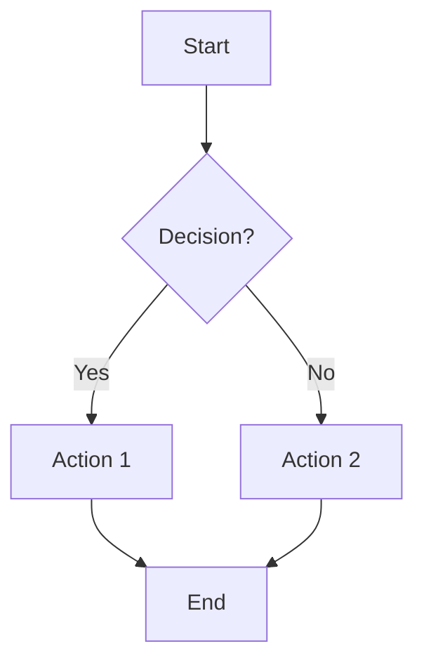

# Flowchart Creation

## Purpose
Create flowcharts for process documentation, decision trees, and workflow visualization.

## Instructions
1. Identify the process or decision to visualize
2. Map the steps, decisions, and outcomes
3. Choose the appropriate diagram tool (Mermaid, draw.io)
4. Generate the flowchart code or markup
5. Refine layout for clarity

## Mermaid Syntax

## Design Principles
- Top-to-bottom or left-to-right flow direction
- Consistent shape conventions (rectangles=process, diamonds=decisions)
- Clear labels on all connections
- Minimize crossing lines
- Group related steps visually

## Best Practices
- Keep flowcharts focused on one process
- Use consistent naming conventions
- Add start and end points explicitly
- Number complex steps for reference
- Version control diagram source code
