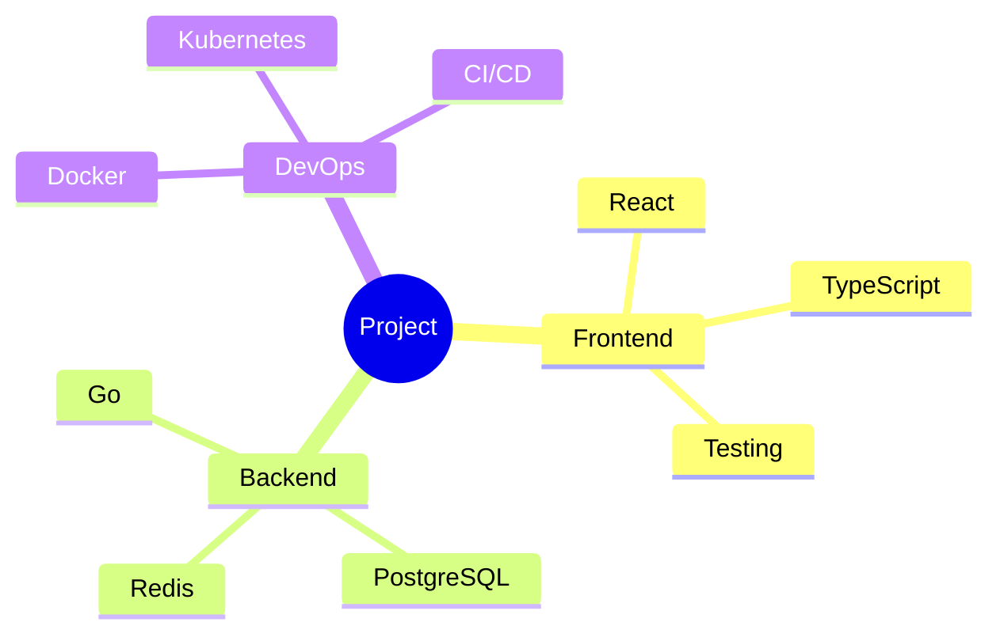

# Mind Map Creation

## Purpose
Create mind maps for brainstorming, planning, and organizing ideas hierarchically.

## Instructions
1. Define the central topic or question
2. Identify main branches (key themes)
3. Add sub-branches with details
4. Connect related ideas across branches
5. Prioritize and annotate key items

## Mermaid Mind Map

## Best Practices
- Start with a clear central topic
- Use keywords, not sentences
- Color-code branches by theme
- Keep the hierarchy balanced
- Review and refine regularly
